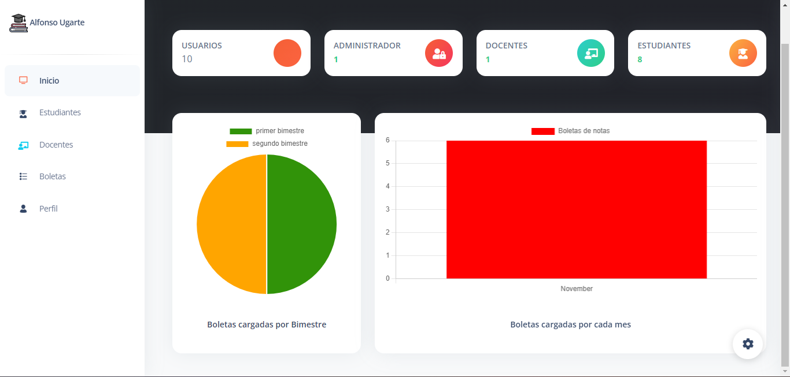

<p align="center"><a href="https://laravel.com" target="_blank"></a></p>

<p align="center">
<a href="https://github.com/laravel/framework/actions"></a>
<a href="https://packagist.org/packages/laravel/framework"></a>
<a href="https://packagist.org/packages/laravel/framework"></a>
<a href="https://packagist.org/packages/laravel/framework"></a>
</p>

## SISTEMA DE BOLETAS INSTITUCION EDUCATIVA ALFONSO UGARTE

Proyecto de mejora e innovacion Carrera de Ingenieria de Software con IA - SENATI 2023

## RECURSOS NECESARIOS
- Laragon Full (64-bit): Apache 2.4, Nginx, MySQL 8, PHP 8, Redis, Memcached, Node.js 18, npm, git https://laragon.org/download/index.html
  
## Entorno de desarrollo
- Instalacion de laragon en el equipo
  
- Iniciallizar los servicios de laragon
  
- Instalacion de laravel desde la consola de laragon https://laravel.com/docs/4.2#install-laravel
```
composer global require "laravel/installer=~1.1"
```
- Clonar el repositorio de GitHub en la carpeta base www de laragon
- RUTA
```
C:\laragon\www
```
- REPOSITORIO
```
git clone https://github.com/JharlynnGb/proyectofinal.git
```
- Desde la consola de laragon abrir el repositorio clonado
```
cd proyectofinal
```
- limpiar la cache del proyecto C:\laragon\www\proyectofinal(main -> origin)
```
php artisan cache:clear
```
- Instalar paquetes composer autoload
```
composer install
```
- remplazar el .env.example por el .env desde la consola 
```
mv .env.example .env
```
- 
- Generar una nueva key para el proyecto en el .env
```
php artisan key:generate
```
Luego de eso remplazar cierto contenido del .env generado, por los siguientes
```
APP_URL=http://127.0.0.1:8000

DB_CONNECTION=mysql
DB_HOST=127.0.0.1
DB_PORT=3306
DB_DATABASE=proyectofinal
DB_USERNAME=root
DB_PASSWORD=

DIALOGFLOW_PROJECT_ID=alfonso-ugarte-tvqm
DIALOGFLOW_KEY_FILE=alfonso-ugarte-tvqm-7bc1f05c738e.json
```
  
### BASE DE DATOS
- En el panel de laragon iniciar el servicio de base de datos
- iniciar una sesion con el host/IP
```
127.0.0.1
```
- Crear la base de datos y todos sus tablas (usar el script)
```
CREATE DATABASE proyectofinal
USE proyectofinal

--crear la tabla usuarios
CREATE TABLE `usuarios` (
    `id` INT(10) NOT NULL AUTO_INCREMENT,
    `username` VARCHAR(50) COLLATE 'utf8mb4_0900_ai_ci',
    `correo` VARCHAR(100) COLLATE 'utf8mb4_0900_ai_ci',
    `password` VARCHAR(100) COLLATE 'utf8mb4_0900_ai_ci',
    `rol` ENUM('Estudiante','Docente','Admin') COLLATE 'utf8mb4_0900_ai_ci',
    `remember_token` VARCHAR(225) COLLATE 'utf8mb4_0900_ai_ci',
    `estado` INT(10) DEFAULT '1',
    `created_at` TIMESTAMP,
    `updated_at` TIMESTAMP,
    PRIMARY KEY (`id`)
) ENGINE=InnoDB AUTO_INCREMENT=1 DEFAULT CHARSET=utf8mb4 COLLATE=utf8mb4_0900_ai_ci;

--crear la tabla grados
CREATE TABLE `grados` (
    `id` INT(10) NOT NULL AUTO_INCREMENT,
    `descripcion` VARCHAR(50) COLLATE 'utf8mb4_0900_ai_ci',
    PRIMARY KEY (`id`)
) ENGINE=InnoDB AUTO_INCREMENT=1 DEFAULT CHARSET=utf8mb4 COLLATE=utf8mb4_0900_ai_ci;


--crear la tabla secciones
CREATE TABLE `secciones` (
    `id` INT(10) NOT NULL AUTO_INCREMENT,
    `descripcion` VARCHAR(10) COLLATE 'utf8mb4_0900_ai_ci',
    PRIMARY KEY (`id`)
) ENGINE=InnoDB AUTO_INCREMENT=1 DEFAULT CHARSET=utf8mb4 COLLATE=utf8mb4_0900_ai_ci;


--crear la tabla bloques
CREATE TABLE `bloques` (
    `id` INT(10) NOT NULL AUTO_INCREMENT,
    `descripcion` VARCHAR(50) COLLATE 'utf8mb4_0900_ai_ci',
    PRIMARY KEY (`id`)
) ENGINE=InnoDB AUTO_INCREMENT=3 DEFAULT CHARSET=utf8mb4 COLLATE=utf8mb4_0900_ai_ci;


--crear la tabla bimestres
CREATE TABLE `bimestres` (
    `id` INT(10) NOT NULL AUTO_INCREMENT,
    `descripcion` VARCHAR(50) COLLATE 'utf8mb4_0900_ai_ci',
    PRIMARY KEY (`id`)
) ENGINE=InnoDB AUTO_INCREMENT=5 DEFAULT CHARSET=utf8mb4 COLLATE=utf8mb4_0900_ai_ci;


--crear la tabla estudiantes
CREATE TABLE `estudiantes` (
    `id` INT(10) NOT NULL AUTO_INCREMENT,
    `User_id` INT(10) NULL,
    `dni` VARCHAR(20),
    `Nombres` VARCHAR(200) COLLATE 'utf8mb4_0900_ai_ci',
    `Apellidos` VARCHAR(200) COLLATE 'utf8mb4_0900_ai_ci',
    `Correo` VARCHAR(200) COLLATE 'utf8mb4_0900_ai_ci',
    `Telefono` VARCHAR(20),
    `Direccion` VARCHAR(200) COLLATE 'utf8mb4_0900_ai_ci',
    `Bloque` INT(10) NULL,
    `Grado` INT(10) NULL,
    `Seccion` INT(10) NULL,
    `FechaNacimiento` DATE NOT NULL,
    `created_at` TIMESTAMP,
    `updated_at` TIMESTAMP,
    PRIMARY KEY (`id`),
    CONSTRAINT `FK_estudiantes_grados` FOREIGN KEY (`Grado`) REFERENCES `grados` (`id`) ON UPDATE NO ACTION ON DELETE NO ACTION,
    CONSTRAINT `FK_estudiantes_secciones` FOREIGN KEY (`Seccion`) REFERENCES `secciones` (`id`) ON UPDATE NO ACTION ON DELETE NO ACTION,
    CONSTRAINT `FK_estudiantes_usuarios` FOREIGN KEY (`User_id`) REFERENCES `usuarios` (`id`) ON UPDATE CASCADE ON DELETE CASCADE,
    CONSTRAINT `FK_estudiante_bloque` FOREIGN KEY (`Bloque`) REFERENCES `bloques` (`id`) ON UPDATE NO ACTION ON DELETE NO ACTION
) ENGINE=InnoDB AUTO_INCREMENT=41 DEFAULT CHARSET=utf8mb4 COLLATE=utf8mb4_0900_ai_ci;


--crear la tabla profesores
CREATE TABLE `profesores` (
    `id` INT(10) NOT NULL AUTO_INCREMENT,
    `User_id` INT(10) NULL,
    `dni` VARCHAR(20) NOT NULL COLLATE 'utf8mb4_0900_ai_ci',
    `Nombres` VARCHAR(50) NOT NULL COLLATE 'utf8mb4_0900_ai_ci',
    `Apellidos` VARCHAR(50) NOT NULL COLLATE 'utf8mb4_0900_ai_ci',
    `Correo` VARCHAR(50) NOT NULL COLLATE 'utf8mb4_0900_ai_ci',
    `Telefono` VARCHAR(50) NOT NULL COLLATE 'utf8mb4_0900_ai_ci',
    `Direccion` VARCHAR(100) NOT NULL COLLATE 'utf8mb4_0900_ai_ci',
    `FechaNacimiento` DATE NOT NULL,
    `Bloque` INT(10) NULL,
    `created_at` TIMESTAMP,
    `updated_at` TIMESTAMP,
    PRIMARY KEY (`id`),
    CONSTRAINT `FK_bloque_profesor` FOREIGN KEY (`Bloque`) REFERENCES `bloques` (`id`) ON UPDATE NO ACTION ON DELETE NO ACTION,
    CONSTRAINT `FK_usuario_profesor` FOREIGN KEY (`User_id`) REFERENCES `usuarios` (`id`) ON UPDATE CASCADE ON DELETE CASCADE
) ENGINE=InnoDB AUTO_INCREMENT=16 DEFAULT CHARSET=utf8mb4 COLLATE=utf8mb4_0900_ai_ci;


--crear la tabla boletas
CREATE TABLE `boletas` (
    `id` INT(10) NOT NULL AUTO_INCREMENT,
    `idEstudiante` INT(10) NOT NULL,
    `idProfesor` INT(10) NOT NULL,
    `idBimestre` INT(10) NOT NULL,
    `Boleta` TEXT NOT NULL COLLATE 'utf8mb4_0900_ai_ci',
    `created_at` TIMESTAMP,
    `updated_at` TIMESTAMP,
    PRIMARY KEY (`id`),
    CONSTRAINT `FK_notas_estudiantes` FOREIGN KEY (`idEstudiante`) REFERENCES `estudiantes` (`id`) ON UPDATE NO ACTION ON DELETE NO ACTION,
    CONSTRAINT `FK-profesor_nota` FOREIGN KEY (`idProfesor`) REFERENCES `profesores` (`id`) ON UPDATE NO ACTION ON DELETE NO ACTION,
    CONSTRAINT `FK_notas_bimestre` FOREIGN KEY (`idBimestre`) REFERENCES `bimestres` (`id`) ON UPDATE NO ACTION ON DELETE NO ACTION
) ENGINE=InnoDB AUTO_INCREMENT=25 DEFAULT CHARSET=utf8mb4 COLLATE=utf8mb4_0900_ai_ci;


--insertamos registros predeterminados

--tabla bloques
INSERT INTO `bloques` (`id`, `descripcion`) VALUES (1, 'primaria');
INSERT INTO `bloques` (`id`, `descripcion`) VALUES (2, 'secundaria');


--tabla grados 
INSERT INTO `grados` (`id`, `descripcion`) VALUES (1, 'primero');
INSERT INTO `grados` (`id`, `descripcion`) VALUES (2, 'segundo');
INSERT INTO `grados` (`id`, `descripcion`) VALUES (3, 'tercero');
INSERT INTO `grados` (`id`, `descripcion`) VALUES (4, 'cuarto');
INSERT INTO `grados` (`id`, `descripcion`) VALUES (5, 'quinto');
INSERT INTO `grados` (`id`, `descripcion`) VALUES (6, 'sexto');

--tabla secciones 
INSERT INTO `secciones` (`id`, `descripcion`) VALUES (1, 'A');
INSERT INTO `secciones` (`id`, `descripcion`) VALUES (2, 'B');
INSERT INTO `secciones` (`id`, `descripcion`) VALUES (3, 'C');
INSERT INTO `secciones` (`id`, `descripcion`) VALUES (4, 'D');

--tabla bimestres
INSERT INTO `bimestres` (`id`, `descripcion`) VALUES (4, '4 bimestre');
INSERT INTO `bimestres` (`id`, `descripcion`) VALUES (3, '3 bimestre');
INSERT INTO `bimestres` (`id`, `descripcion`) VALUES (2, '2 bimestre');
INSERT INTO `bimestres` (`id`, `descripcion`) VALUES (1, '1 bimestre');

--para esta opotunidad de prueba se creara un usuario ADMIN para gestionar el resto
--PASSWORD administrador (bcrypt) convertir https://www.browserling.com/tools/bcrypt

INSERT INTO `usuarios` (`id`, `username`, `correo`, `password`, `rol`, `remember_token`, `estado`, `created_at`, `updated_at`) VALUES (3, 'administrador', 'admin@gmail.com', '{password encriptado}', 'Admin', NULL, 1, '2023-10-19 16:12:48', '2023-11-05 07:28:43');

--las tablas estudiante y docente se trabajan desde el sistema
```

## EJECUCION 
Si los pasos anteriores se completaron sin problemas correr el programa
```
php artisan serv
```
Esta seria la respuesta de la consola si todo esta okey 
```
C:\laragon\www\proyectofinal(main -> origin)
λ php artisan serv

   INFO  Server running on [http://127.0.0.1:8000].

  Press Ctrl+C to stop the server
```
Pegar el servidor http://127.0.0.1:8000 en el navegador y probar la demo 

## PRUEBA


